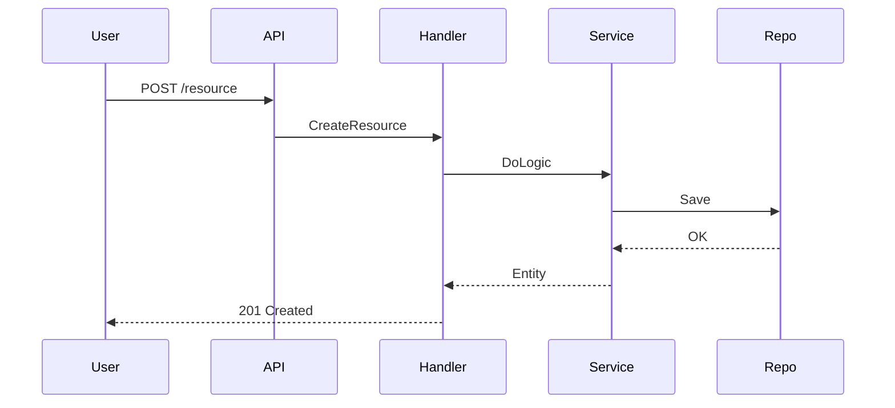

# API Documentation Generation Skill

This skill provides comprehensive instructions for using Kest CLI to generate high-quality, hallucination-free API documentation that stays perfectly aligned with your Go source code.

## 🎯 Core Principles

1.  **Strict Schema Adherence**: Documentation must reflect actual DTOs and database models.
2.  **Zero Hallucination**: If the code doesn't return it, the docs shouldn't mention it.
3.  **Visual Clarity**: Use Mermaid diagrams for complex business flows.
4.  **Security First**: Explicitly document permission requirements and role levels.

## 🚀 Documentation Workflow

### 1. Basic Generation
Scan a project and output Markdown files for each module.
```bash
kest doc <project-path> -o <output-dir>
```

### 2. AI-Enhanced Generation (Recommended)
Uses AI to analyze business logic and generate realistic examples, Mermaid diagrams, and permission descriptions.
```bash
kest doc <project-path> -o <output-dir> --ai
```

### 3. Selective Module Generation
Focus on a single module for debugging or rapid iteration.
```bash
kest doc <project-path> -o <output-dir> -m <module-name> --ai
```

## 🧠 Best Practices for Alignment

-   **Struct Tags**: Ensure your Go structs have proper `json:""` and `binding:""` tags. Kest uses these to generate the request/response samples.
-   **Middleware Context**: Kest scans for middleware like `auth` or `permission` to document access requirements.
-   **Error Handling**: Use structured error responses to help the AI identify status codes and error messages.

## 🛠️ Advanced Features

### Anti-Hallucination Rules
The latest v0.6.0 version includes strict rules to prevent:
-   **Ghost Wrapping**: Adding unnecessary parent keys (e.g., `{"items": [...]}`) to top-level arrays.
-   **Innovation**: Renaming fields that exist in the JSON tags.
-   **Missing Fields**: Omitting fields defined in the DTOs.

### Mermaid Flow Generation
Kest analyzes the `handler -> service -> repository` flow to generate sequence diagrams:


## 🏁 Quality Checklist

- [ ] Does the `request_example` match the `json` tags in the Request DTO?
- [ ] Are all fields in the Response DTO present in the `response_example`?
- [ ] Is the Mermaid diagram logically consistent with the Go source?
- [ ] Are the permission descriptions accurate based on middlewares?
