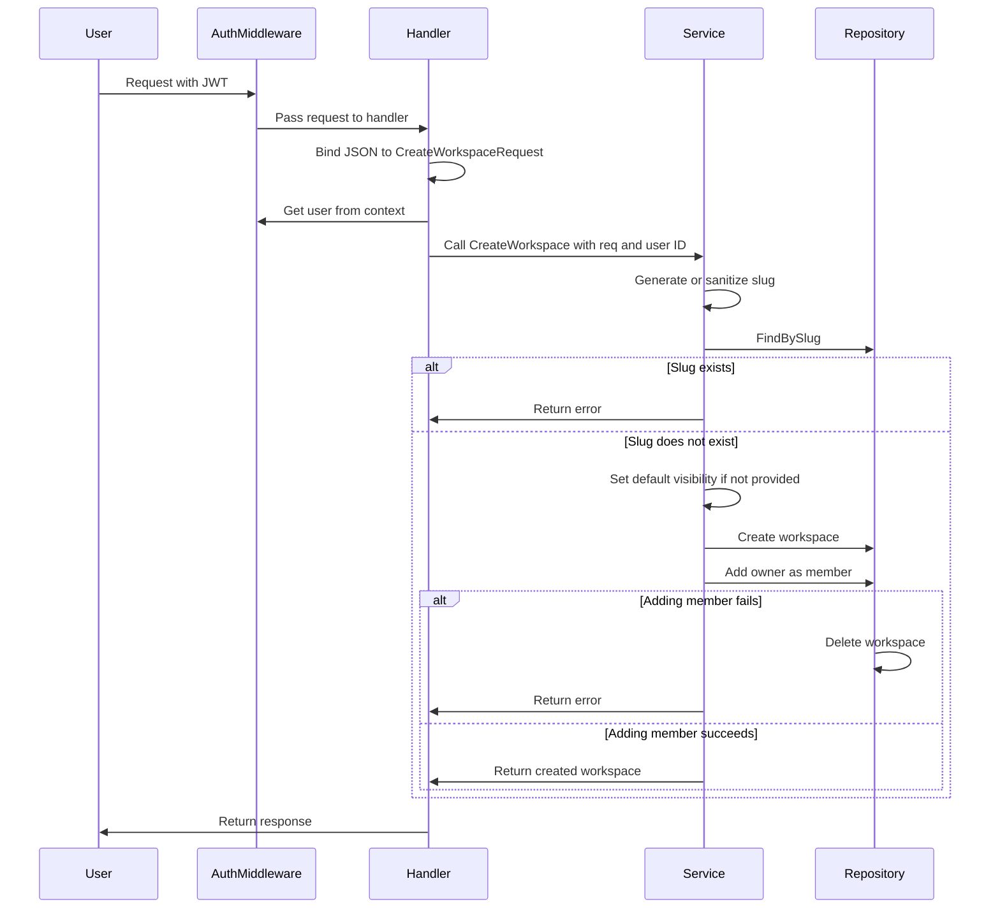
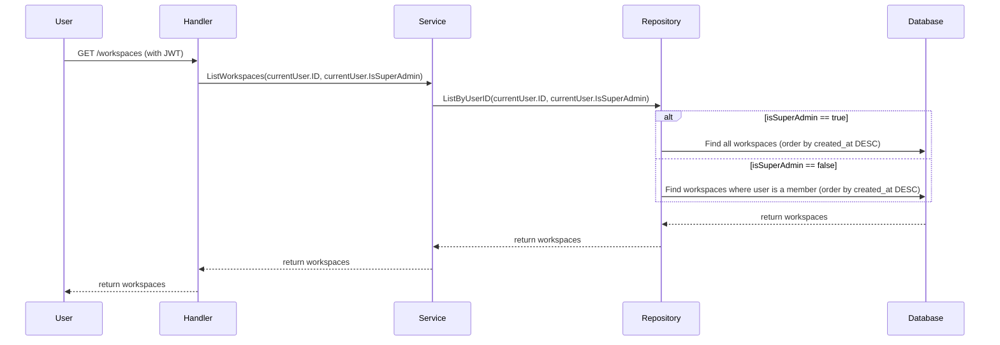
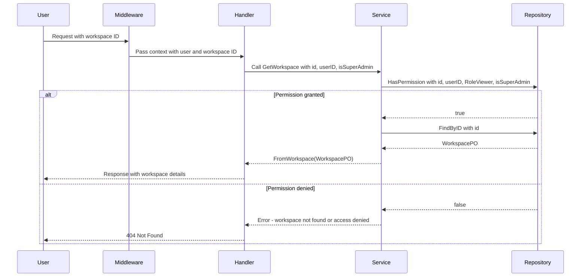
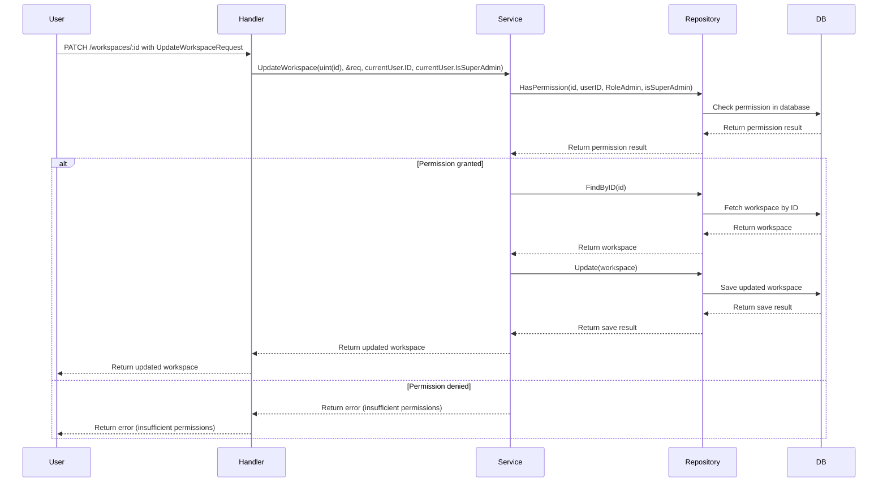
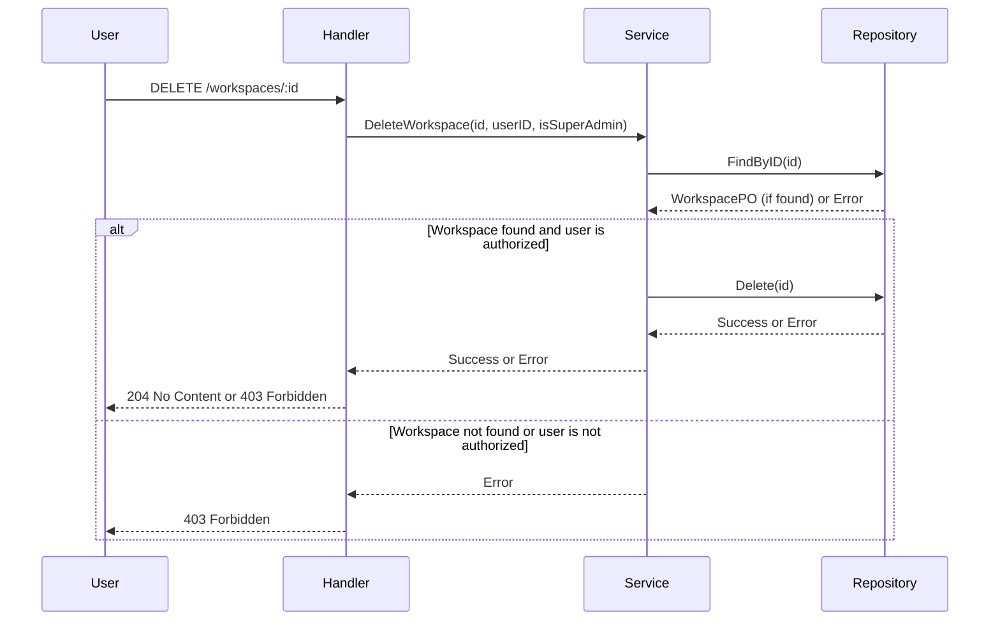
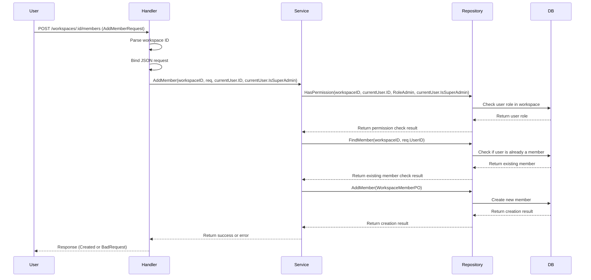
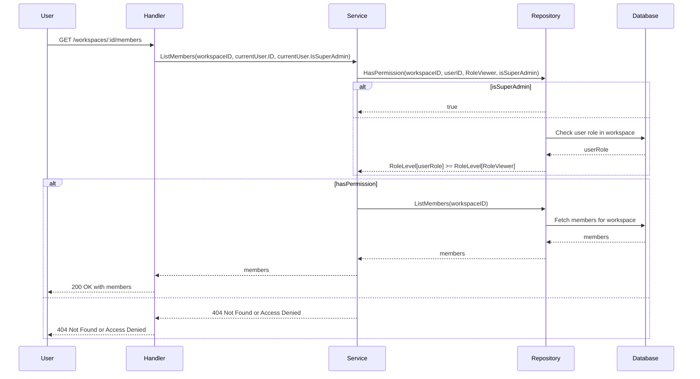
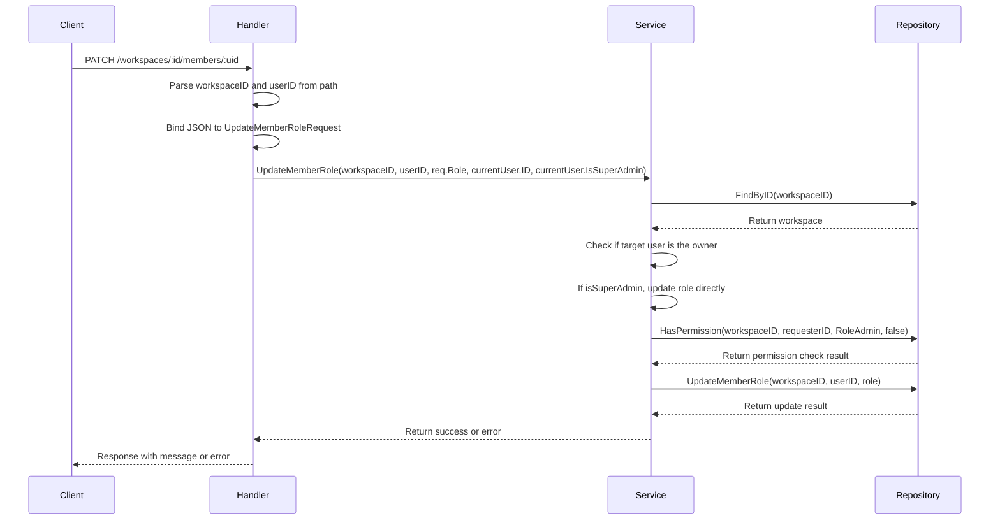
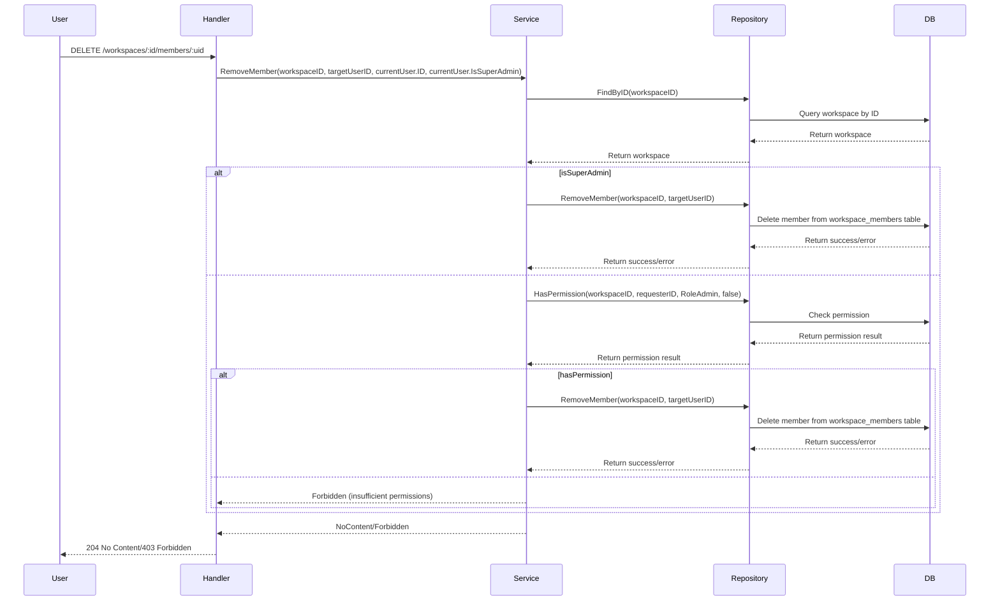

# Workspace Module API

> 💡 This documentation is automatically synchronized with the source code.

## 🎯 Module Purpose

### Module Purpose

**Business Value:**
The `workspace` module provides a comprehensive set of endpoints to manage and interact with workspaces, which are collaborative environments for teams. This module enables users to create, read, update, and delete (CRUD) workspaces, as well as manage workspace members. By offering these functionalities, the module enhances team collaboration and organizational efficiency, ensuring that users can easily organize and control access to their workspaces.

**Scope:**
The `workspace` module manages the lifecycle of workspaces and their associated members. It includes endpoints for creating, listing, retrieving, updating, and deleting workspaces. Additionally, it provides endpoints for managing workspace members, such as adding, listing, updating roles, and removing members. This ensures that all aspects of workspace management are covered, from basic operations to more granular control over member permissions.

**Role:**
This module is a core module, as it provides essential functionality for managing collaborative environments. The ability to create and manage workspaces and their members is fundamental to any application that supports team-based collaboration. The `workspace` module serves as a foundational component, enabling other modules and features to build upon its capabilities.

## 📌 Overview

The `workspace` module provides the following API endpoints:

| Method | Path | Description |
| :--- | :--- | :--- |
| <kbd>POST</kbd> | `/workspaces` | Create a new workspace for the authenticated user |
| <kbd>GET</kbd> | `/workspaces` | List all workspaces that the authenticated user is a member of or has access to if they are a super admin |
| <kbd>GET</kbd> | `/workspaces/:id` | Retrieve a specific workspace by ID, accessible to users with at least viewer role or super admins |
| <kbd>PATCH</kbd> | `/workspaces/:id` | Update a workspace by ID. Only the owner, an admin, or a super admin can update a workspace. |
| <kbd>DELETE</kbd> | `/workspaces/:id` | Delete a workspace by its ID. Only the workspace owner or a super admin can delete a workspace. |
| <kbd>POST</kbd> | `/workspaces/:id/members` | Add a new member to a workspace |
| <kbd>GET</kbd> | `/workspaces/:id/members` | List members of a specific workspace |
| <kbd>PATCH</kbd> | `/workspaces/:id/members/:uid` | Update the role of a member in a workspace |
| <kbd>DELETE</kbd> | `/workspaces/:id/members/:uid` | Remove a member from a workspace |

---

## Create a new workspace for the authenticated user

**Endpoint:**
<kbd>POST</kbd> `/workspaces`

### 🛡️ Permissions

User must be authenticated with a valid JWT token

### 🗺️ Logic Flow



### 📥 Request: `CreateWorkspaceRequest`

| JSON Field | Type | Required/Validation | Description |
| :--- | :--- | :--- | :--- |
| `name` | `string` | `required,max=100` |  |
| `slug` | `string` | `required,max=50,alphanum` |  |
| `description` | `string` | `max=500` |  |
| `type` | `string` | `required,oneof=personal team public` |  |
| `visibility` | `string` | `oneof=private team public` |  |

**Request Example:**
```json
{
    "name": "My New Workspace",
    "slug": "my-new-workspace",
    "description": "This is my new workspace for personal projects.",
    "type": "personal",
    "visibility": "private"
  }
```

**Response Example:**
```json
{
    "id": 1,
    "name": "My New Workspace",
    "slug": "my-new-workspace",
    "description": "This is my new workspace for personal projects.",
    "type": "personal",
    "owner_id": 1,
    "visibility": "private"
  }
```

**Handler Implementation:**
`workspace.CreateWorkspace`

---

## List all workspaces that the authenticated user is a member of or has access to if they are a super admin

**Endpoint:**
<kbd>GET</kbd> `/workspaces`

### 🛡️ Permissions

JWT token required. Super admins can see all workspaces, regular users can only see workspaces they are members of.

### 🗺️ Logic Flow



**Request Example:**
```json
{}
```

**Response Example:**
```json
[
    {
      "id": 1,
      "name": "Workspace 1",
      "slug": "workspace-1",
      "description": "This is the first workspace.",
      "type": "team",
      "visibility": "private",
      "created_at": "2023-10-01T12:00:00Z"
    },
    {
      "id": 2,
      "name": "Workspace 2",
      "slug": "workspace-2",
      "description": "This is the second workspace.",
      "type": "personal",
      "visibility": "public",
      "created_at": "2023-10-02T12:00:00Z"
    }
  ]
```

**Handler Implementation:**
`workspace.ListWorkspaces`

---

## Retrieve a specific workspace by ID, accessible to users with at least viewer role or super admins

**Endpoint:**
<kbd>GET</kbd> `/workspaces/:id`

### 🛡️ Permissions

⚠️ SECURITY RISK: The endpoint checks if the user has at least a viewer role or is a super admin. However, it does not explicitly check for a valid JWT token in the middleware.

### 🗺️ Logic Flow



**Request Example:**
```json
{}
```

**Response Example:**
```json
{
    "id": 1,
    "name": "Example Workspace",
    "slug": "example-workspace",
    "description": "This is an example workspace.",
    "type": "team",
    "visibility": "private"
  }
```

**Handler Implementation:**
`workspace.GetWorkspace`

---

## Update a workspace by ID. Only the owner, an admin, or a super admin can update a workspace.

**Endpoint:**
<kbd>PATCH</kbd> `/workspaces/:id`

### 🛡️ Permissions

⚠️ SECURITY RISK: Only the owner, an admin, or a super admin can update a workspace. The current implementation checks for these roles but does not explicitly validate the JWT token or user session.

### 🗺️ Logic Flow



### 📥 Request: `UpdateWorkspaceRequest`

| JSON Field | Type | Required/Validation | Description |
| :--- | :--- | :--- | :--- |
| `name` | `*string` | `omitempty,max=100` |  |
| `description` | `*string` | `omitempty,max=500` |  |
| `visibility` | `*string` | `omitempty,oneof=private team public` |  |

**Request Example:**
```json
{
    "name": "Updated Workspace Name",
    "description": "This is an updated description for the workspace.",
    "visibility": "public"
  }
```

**Response Example:**
```json
{
    "id": 1,
    "name": "Updated Workspace Name",
    "description": "This is an updated description for the workspace.",
    "visibility": "public"
  }
```

**Handler Implementation:**
`workspace.UpdateWorkspace`

---

## Delete a workspace by its ID. Only the workspace owner or a super admin can delete a workspace.

**Endpoint:**
<kbd>DELETE</kbd> `/workspaces/:id`

### 🛡️ Permissions

⚠️ SECURITY RISK: This endpoint requires the user to be authenticated and either the workspace owner or a super admin.

### 🗺️ Logic Flow



**Request Example:**
```json
{}
```

**Response Example:**
```json
{}
```

**Handler Implementation:**
`workspace.DeleteWorkspace`

---

## Add a new member to a workspace

**Endpoint:**
<kbd>POST</kbd> `/workspaces/:id/members`

### 🛡️ Permissions

⚠️ SECURITY RISK: Only users with admin, owner, or super admin roles can add members to a workspace. The user must be authenticated and have the necessary permissions.

### 🗺️ Logic Flow



### 📥 Request: `AddMemberRequest`

| JSON Field | Type | Required/Validation | Description |
| :--- | :--- | :--- | :--- |
| `user_id` | `uint` | `required` |  |
| `role` | `string` | `required,oneof=owner admin editor viewer` |  |

**Request Example:**
```json
{
    "user_id": 123,
    "role": "editor"
  }
```

**Response Example:**
```json
{
    "message": "member added successfully"
  }
```

**Handler Implementation:**
`workspace.AddMember`

---

## List members of a specific workspace

**Endpoint:**
<kbd>GET</kbd> `/workspaces/:id/members`

### 🛡️ Permissions

User must be authenticated and have at least 'viewer' role or be a super admin to access the workspace members.

### 🗺️ Logic Flow



**Request Example:**
```json
{}
```

**Response Example:**
```json
[
    {
      "user_id": 1,
      "role": "owner",
      "joined_at": "2023-10-01T12:00:00Z"
    },
    {
      "user_id": 2,
      "role": "admin",
      "joined_at": "2023-10-02T12:00:00Z"
    }
  ]
```

**Handler Implementation:**
`workspace.ListMembers`

---

## Update the role of a member in a workspace

**Endpoint:**
<kbd>PATCH</kbd> `/workspaces/:id/members/:uid`

### 🛡️ Permissions

⚠️ SECURITY RISK: Only super admins, workspace owners, and admins can update member roles. Regular users cannot change the role of the workspace owner.

### 🗺️ Logic Flow



### 📥 Request: `UpdateMemberRoleRequest`

| JSON Field | Type | Required/Validation | Description |
| :--- | :--- | :--- | :--- |
| `role` | `string` | `required,oneof=owner admin editor viewer` |  |

**Request Example:**
```json
{
    "role": "editor"
  }
```

**Response Example:**
```json
{
    "message": "role updated successfully"
  }
```

**Handler Implementation:**
`workspace.UpdateMemberRole`

---

## Remove a member from a workspace

**Endpoint:**
<kbd>DELETE</kbd> `/workspaces/:id/members/:uid`

### 🛡️ Permissions

User must be authenticated and have the 'admin' role or be a super admin to remove members. The owner cannot be removed.

### 🗺️ Logic Flow



**Request Example:**
```json
{}
```

**Response Example:**
```json
{}
```

**Handler Implementation:**
`workspace.RemoveMember`

---

