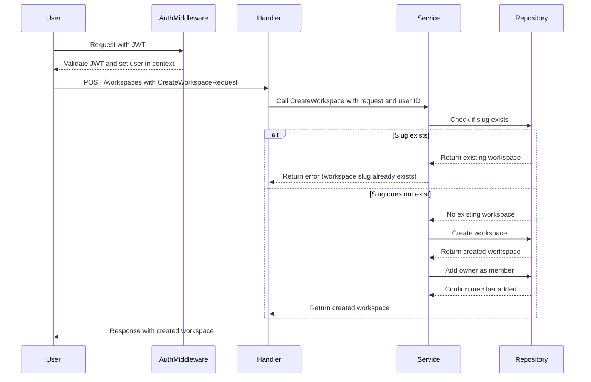
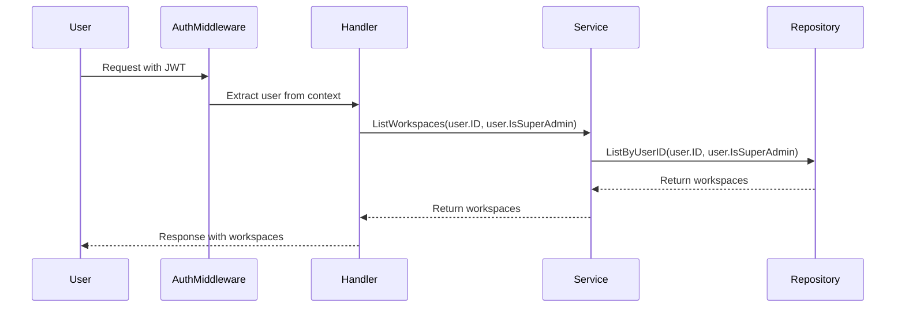
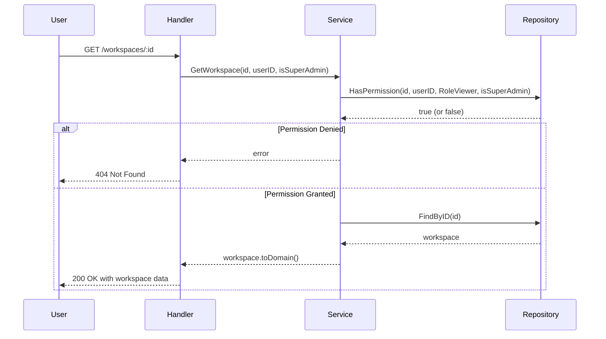
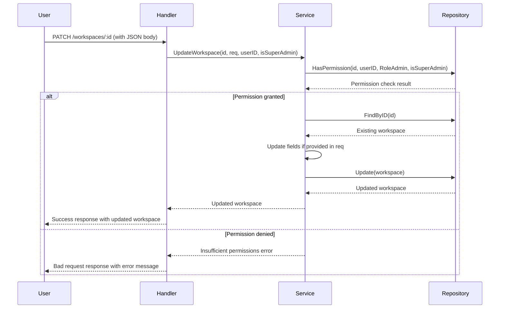
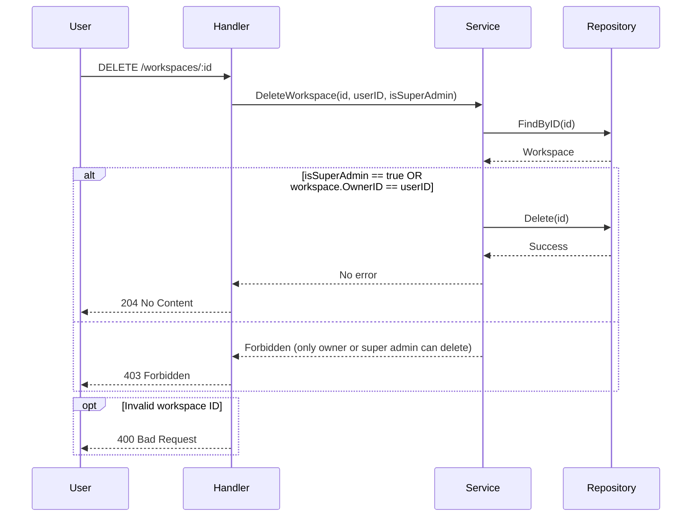
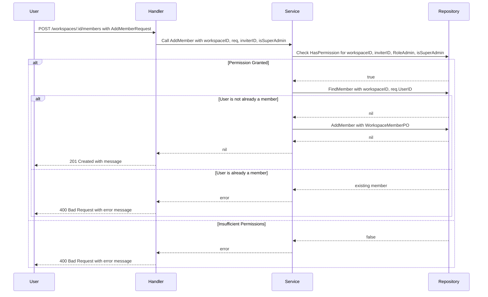
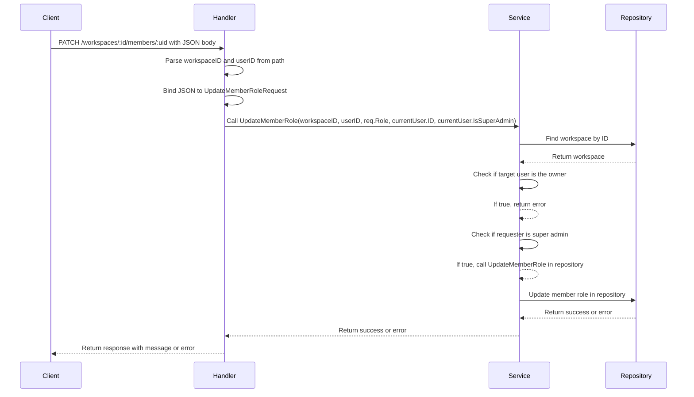

# Workspace Module API

> 💡 This documentation is automatically synchronized with the source code.

## 🎯 Module Purpose

### Module Purpose

**Business Value:**
The `workspace` module provides a comprehensive set of endpoints to manage collaborative workspaces, enabling users to create, list, retrieve, update, and delete workspaces. This module facilitates efficient collaboration by allowing users to add, list, update, and remove members from workspaces, along with managing their roles. By centralizing workspace management, the module enhances productivity and ensures that all team members have the appropriate access and permissions, thereby streamlining project management and team coordination.

**Scope:**
The `workspace` module manages the lifecycle of workspaces and their associated members. It includes functionalities for creating, listing, retrieving, updating, and deleting workspaces, as well as adding, listing, updating, and removing members from these workspaces. The module ensures that each user can only access and manage the workspaces they are authorized to, maintaining data integrity and security.

**Role:**
This module is a core module, as it provides essential functionality for managing collaborative environments. It is integral to the application's ability to support team-based projects and collaboration, making it a foundational component of the system.

## 📌 Overview

The `workspace` module provides the following API endpoints:

| Method | Path | Description |
| :--- | :--- | :--- |
| <kbd>POST</kbd> | `/workspaces` | Create a new workspace for the authenticated user |
| <kbd>GET</kbd> | `/workspaces` | List all workspaces for the authenticated user. If the user is a super admin, list all workspaces in the system. |
| <kbd>GET</kbd> | `/workspaces/:id` | Retrieve a specific workspace by ID, ensuring the user has the necessary permissions to view it. |
| <kbd>PATCH</kbd> | `/workspaces/:id` | Update an existing workspace with new details |
| <kbd>DELETE</kbd> | `/workspaces/:id` | Delete a specific workspace by ID. Only the workspace owner or a super admin can delete a workspace. |
| <kbd>POST</kbd> | `/workspaces/:id/members` | Add a member to a specific workspace |
| <kbd>GET</kbd> | `/workspaces/:id/members` | ListMembers lists all members of a workspace |
| <kbd>PATCH</kbd> | `/workspaces/:id/members/:uid` | Update the role of a member in a workspace |
| <kbd>DELETE</kbd> | `/workspaces/:id/members/:uid` | Remove a member from a workspace |

---

## Create a new workspace for the authenticated user

**Endpoint:**
<kbd>POST</kbd> `/workspaces`

### 🛡️ Permissions

Authenticated user with a valid JWT token

### 🗺️ Logic Flow



### 📥 Request: `CreateWorkspaceRequest`

| JSON Field | Type | Required/Validation | Description |
| :--- | :--- | :--- | :--- |
| `name` | `string` | `required,max=100` |  |
| `slug` | `string` | `required,max=50,alphanum` |  |
| `description` | `string` | `max=500` |  |
| `type` | `string` | `required,oneof=personal team public` |  |
| `visibility` | `string` | `oneof=private team public` |  |

**Request Example:**
```json
{
    "name": "My New Workspace",
    "slug": "my-new-workspace",
    "description": "This is my new workspace for personal projects.",
    "type": "personal",
    "visibility": "private"
  }
```

**Response Example:**
```json
{
    "id": 1,
    "name": "My New Workspace",
    "slug": "my-new-workspace",
    "description": "This is my new workspace for personal projects.",
    "type": "personal",
    "owner_id": 1,
    "visibility": "private"
  }
```

**Handler Implementation:**
`workspace.CreateWorkspace`

---

## List all workspaces for the authenticated user. If the user is a super admin, list all workspaces in the system.

**Endpoint:**
<kbd>GET</kbd> `/workspaces`

### 🛡️ Permissions

User must be authenticated with a valid JWT token. Super admins will see all workspaces, while regular users will only see their own workspaces.

### 🗺️ Logic Flow



**Request Example:**
```json
{}
```

**Response Example:**
```json
[
    {
      "id": 1,
      "name": "Workspace A",
      "slug": "workspace-a",
      "description": "This is Workspace A",
      "type": "personal",
      "visibility": "private"
    },
    {
      "id": 2,
      "name": "Workspace B",
      "slug": "workspace-b",
      "description": "This is Workspace B",
      "type": "team",
      "visibility": "team"
    }
  ]
```

**Handler Implementation:**
`workspace.ListWorkspaces`

---

## Retrieve a specific workspace by ID, ensuring the user has the necessary permissions to view it.

**Endpoint:**
<kbd>GET</kbd> `/workspaces/:id`

### 🛡️ Permissions

User must be authenticated and have at least viewer access to the workspace or be a super admin.

### 🗺️ Logic Flow



**Request Example:**
```json
{}
```

**Response Example:**
```json
{
    "id": 1,
    "name": "My Workspace",
    "slug": "my-workspace",
    "description": "This is my personal workspace for all my projects.",
    "type": "personal",
    "visibility": "private",
    "created_at": "2023-10-01T12:00:00Z",
    "updated_at": "2023-10-01T12:00:00Z"
  }
```

**Handler Implementation:**
`workspace.GetWorkspace`

---

## Update an existing workspace with new details

**Endpoint:**
<kbd>PATCH</kbd> `/workspaces/:id`

### 🛡️ Permissions

User must be the owner, admin, or a super admin to update the workspace

### 🗺️ Logic Flow



### 📥 Request: `UpdateWorkspaceRequest`

| JSON Field | Type | Required/Validation | Description |
| :--- | :--- | :--- | :--- |
| `name` | `*string` | `omitempty,max=100` |  |
| `description` | `*string` | `omitempty,max=500` |  |
| `visibility` | `*string` | `omitempty,oneof=private team public` |  |

**Request Example:**
```json
{
    "name": "Updated Workspace Name",
    "description": "This is an updated description for the workspace.",
    "visibility": "public"
  }
```

**Response Example:**
```json
{
    "id": 1,
    "name": "Updated Workspace Name",
    "description": "This is an updated description for the workspace.",
    "visibility": "public",
    "created_at": "2023-10-01T12:00:00Z",
    "updated_at": "2023-10-05T14:30:00Z"
  }
```

**Handler Implementation:**
`workspace.UpdateWorkspace`

---

## Delete a specific workspace by ID. Only the workspace owner or a super admin can delete a workspace.

**Endpoint:**
<kbd>DELETE</kbd> `/workspaces/:id`

### 🛡️ Permissions

User must be authenticated and either the workspace owner or a super admin.

### 🗺️ Logic Flow



**Request Example:**
```json
{}
```

**Response Example:**
```json
{}
```

**Handler Implementation:**
`workspace.DeleteWorkspace`

---

## Add a member to a specific workspace

**Endpoint:**
<kbd>POST</kbd> `/workspaces/:id/members`

### 🛡️ Permissions

User must be an admin, owner, or super admin of the workspace to add members

### 🗺️ Logic Flow



### 📥 Request: `AddMemberRequest`

| JSON Field | Type | Required/Validation | Description |
| :--- | :--- | :--- | :--- |
| `user_id` | `uint` | `required` |  |
| `role` | `string` | `required,oneof=owner admin editor viewer` |  |

**Request Example:**
```json
{
    "user_id": 123,
    "role": "editor"
  }
```

**Response Example:**
```json
{
    "message": "member added successfully"
  }
```

**Handler Implementation:**
`workspace.AddMember`

---

## ListMembers lists all members of a workspace

**Endpoint:**
<kbd>GET</kbd> `/workspaces/:id/members`

**Handler Implementation:**
`workspace.ListMembers`

---

## Update the role of a member in a workspace

**Endpoint:**
<kbd>PATCH</kbd> `/workspaces/:id/members/:uid`

### 🛡️ Permissions

The user must be authenticated and have admin or super admin permissions in the workspace. Super admins can change any role except the owner's role.

### 🗺️ Logic Flow



### 📥 Request: `UpdateMemberRoleRequest`

| JSON Field | Type | Required/Validation | Description |
| :--- | :--- | :--- | :--- |
| `role` | `string` | `required,oneof=owner admin editor viewer` |  |

**Request Example:**
```json
{
    "role": "admin"
  }
```

**Response Example:**
```json
{
    "message": "role updated successfully"
  }
```

**Handler Implementation:**
`workspace.UpdateMemberRole`

---

## Remove a member from a workspace

**Endpoint:**
<kbd>DELETE</kbd> `/workspaces/:id/members/:uid`

### 🛡️ Permissions

The user must be authenticated and have admin or superadmin permissions in the workspace. Superadmins can remove any member except the owner, while regular admins can only remove members if they have the appropriate role.

### 🗺️ Logic Flow

```mermaid
sequenceDiagram
    participant User
    participant Handler
    participant Service
    participant Repository

    User->>Handler: DELETE /workspaces/:id/members/:uid
    Handler->>Handler: Parse workspaceID and userID from path params
    alt Invalid workspaceID or userID
        Handler-->>User: 400 Bad Request
    else Valid IDs
        Handler->>Service: Call RemoveMember(workspaceID, userID, currentUser.ID, currentUser.IsSuperAdmin)
        Service->>Repository: Find workspace by ID
        alt Workspace not found
            Service-->>Handler: Error
            Handler-->>User: 404 Not Found
        else Workspace found
            Service->>Service: Check if target user is the owner
            alt Target user is the owner
                Service-->>Handler: Error (cannot remove owner)
                Handler-->>User: 403 Forbidden
            else Target user is not the owner
                alt currentUser is superadmin
                    Service->>Repository: Remove member
                    Repository-->>Service: Success/Failure
                    Service-->>Handler: Success/Failure
                    Handler-->>User: 204 No Content / 403 Forbidden
                else currentUser is not superadmin
                    Service->>Repository: Check permission
                    Repository-->>Service: hasPermission
                    alt Insufficient permissions
                        Service-->>Handler: Error (insufficient permissions)
                        Handler-->>User: 403 Forbidden
                    else Sufficient permissions
                        Service->>Repository: Remove member
                        Repository-->>Service: Success/Failure
                        Service-->>Handler: Success/Failure
                        Handler-->>User: 204 No Content / 403 Forbidden
                end
            end
        end
    end
```

**Request Example:**
```json
{}
```

**Response Example:**
```json
{}
```

**Handler Implementation:**
`workspace.RemoveMember`

---

